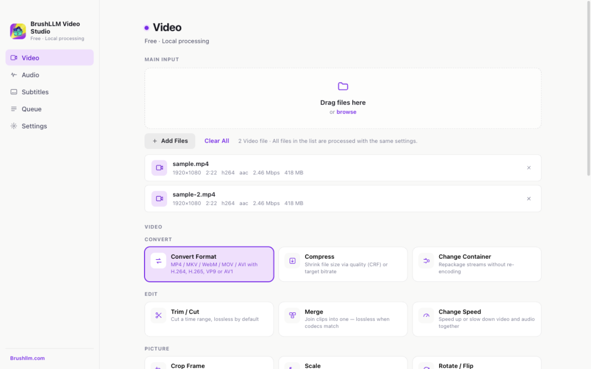

<p align="center">
  
</p>

<h1 align="center">BrushLLM Video Studio</h1>

<p align="center">
  <a href="https://github.com/BrushLLM/brushllm-video-studio/releases"></a>
  <a href="LICENSE"></a>
  
  
</p>

<p align="center">
  <strong><a href="https://www.brushllm.com">🌐 brushllm.com</a></strong> · <a href="https://github.com/BrushLLM/brushllm-video-studio/releases">Releases</a>
</p>

<p align="center">A local-first desktop video toolbox — 33 operations across video, audio and subtitles, all running 100% on your device. Free, offline, private.</p>

<p align="center">
  
</p>

[English](#english) | [Deutsch](#deutsch) | [Español](#español) | [Français](#français) | [Bahasa Indonesia](#bahasa-indonesia) | [Italiano](#italiano) | [Nederlands](#nederlands) | [Polski](#polski) | [Português (BR)](#português-br) | [Türkçe](#türkçe) | [Tiếng Việt](#tiếng-việt) | [简体中文](#简体中文) | [繁體中文](#繁體中文) | [日本語](#日本語) | [한국어](#한국어)

---

## English

### ✨ Features

- **Video** (12 tools) — Convert (MP4 / MKV / WebM / MOV / AVI × H.264 / H.265 / VP9 / AV1) · Compress (CRF or bitrate) · Merge (lossless when codecs match) · Trim · Crop · Scale · Rotate / Flip · Speed (0.25–4×) · Extract Frames · GIF / WebP · Metadata · Container swap
- **Audio** (8 tools) — Convert (MP3, M4A, FLAC, WAV, OGG, Opus) · Compress · Trim · Volume · Loudness normalization (EBU R128) · Extract from video · Remove / Replace track
- **Subtitles** (6 tools) — SRT / VTT / ASS / SSA / TTML conversion (instant) · Timing shift · Encoding fix (GBK / Big5 → UTF-8) · Extract from video · Embed · Burn
- **All operations support batch processing** — apply the same settings to an entire file list
- Hardware acceleration with honest GPU detection (VideoToolbox on macOS) · 15-language UI · live CPU utilization · prevent-sleep during processing · pause / resume · zero telemetry

### 📥 Download

Grab the latest installer from [Releases](https://github.com/BrushLLM/brushllm-video-studio/releases):

| Platform | File |
| --- | --- |
| macOS — Apple Silicon (M-series) | `.dmg` (arm64) |
| Windows 10/11 — x64 (Intel/AMD) | `.exe` (x64) |
| Windows 10/11 — ARM64 (Snapdragon) | `.exe` (arm64) |

> **Apps are unsigned.** macOS: right-click the app → **Open** on first launch (Gatekeeper). Windows: choose **Run anyway** when SmartScreen appears — the installer opens with a 15-language selector.

### 🌐 UI Languages

English · Deutsch · Español · Français · Bahasa Indonesia · Italiano · Nederlands · Polski · Português (BR) · Türkçe · Tiếng Việt · 日本語 · 简体中文 · 繁體中文 · 한국어

Switch instantly in Settings — no restart.

<details>
<summary><strong>🛠 Develop</strong></summary>

```bash
npm install
npm run fetch-binaries   # download pinned FFmpeg/ffprobe (SHA-256 verified)
npm start                # launch the app
```

Tests: `npm test` — unit + end-to-end with real FFmpeg.

</details>

<details>
<summary><strong>🏗 Architecture</strong></summary>

- **UI** — React 18 + Vite in Electron. `src/pages` (tool pages) → `src/components` → `src/lib/bridge.js` (typed IPC wrappers).
- **Engine** (`electron/engine`) — pure Node.js: `commands.js` (pure function: op + params → FFmpeg args, unit-tested), `queue.js` (job lifecycle, progress, pause/resume, CPU sampling), `resolve.mjs` (central encoding resolver shared by UI plan and actual command).
- **Subtitle engine** (`shared/subtitles.js`) — pure JS, no dependencies: parse/write SRT, VTT, ASS, SSA, TTML; charset detection (UTF-8/GBK/Big5/Shift-JIS).
- **Media engine** — pinned FFmpeg/ffprobe binaries per platform (SHA-256 verified), fetched via `scripts/fetch-binaries.mjs`.
- **CI** — GitHub Actions builds all three platform installers on tag push.

</details>

### ⚠️ Known limitations

- Image-based subtitles (PGS/DVD) are not supported yet — planned for the AI version.
- GPU acceleration uses VideoToolbox on macOS; NVENC/QSV/AMF code is ready but untested on Windows.
- Apps are unsigned (code signing can be added to CI later).

---

## Deutsch

Ein lokal-first Desktop-Werkzeugkasten für Video — 33 Operationen für Video, Audio und Untertitel, alle laufen 100% auf deinem Gerät. Kostenlos, offline, privat.

**Werkzeuge:** Format konvertieren · Komprimieren · Zusammenfügen · Schneiden · Rogneren · Skalieren · Drehen · Geschwindigkeit · Einzelbilder · GIF/WebP · Metadaten · Container wechseln · Audio konvertieren · Komprimieren · Schneiden · Lautstärke · Loudness · Audio extrahieren/ersetzen · Untertitel konvertieren · Verschieben · Kodierung.

**Highlights:** UI in 15 Sprachen · Hardware-Beschleunigung mit ehrlicher GPU-Erkennung · Stapelverarbeitung · CPU-Auslastung live · Ruhezustand verhindern · keine Telemetrie.

**📥 Herunterladen:** aktuelle Installationspakete auf [Releases](https://github.com/BrushLLM/brushllm-video-studio/releases) — macOS `.dmg` (Apple Silicon), Windows `.exe` (x64 / ARM64). Unsignierte Apps lösen beim ersten Start eine Warnung aus (macOS: Rechtsklick → „Öffnen“; Windows: „Ausführen“ wählen).

Entwicklung und Architektur: siehe Abschnitt [English](#english).

---

## Español

Una caja de herramientas de vídeo local-first — 33 operaciones de vídeo, audio y subtítulos, todas se ejecutan 100% en tu equipo. Gratis, sin conexión, privado.

**Herramientas:** Convertir formato · Comprimir · Unir · Recortar · Recortar encuadre · Redimensionar · Rotar · Velocidad · Fotogramas · GIF/WebP · Metadatos · Cambiar contenedor · Convertir audio · Comprimir · Recortar · Volumen · Sonoridad · Extraer/Reemplazar audio · Convertir subtítulos · Desplazar · Codificación.

**Lo destacado:** interfaz en 15 idiomas · aceleración por hardware con detección honesta de GPU · proceso por lotes · uso de CPU en vivo · evitar suspensión · sin telemetría.

**📥 Descargar:** instaladores en [Releases](https://github.com/BrushLLM/brushllm-video-studio/releases) — macOS `.dmg` (Apple Silicon), Windows `.exe` (x64 / ARM64). Apps sin firmar: en el primer inicio, macOS exige clic derecho → *Abrir*; Windows muestra SmartScreen → *Ejecutar de todas formas*.

Desarrollo y arquitectura: ver la sección [English](#english).

---

## Français

Une boîte à outils vidéo local-first — 33 opérations vidéo, audio et sous-titres, toutes exécutées 100% sur votre machine. Gratuit, hors ligne, privé.

**Outils :** Convertir le format · Compresser · Fusionner · Découper · Rogner · Redimensionner · Pivoter · Vitesse · Images · GIF/WebP · Métadonnées · Changer de conteneur · Convertir l'audio · Compresser · Découper · Volume · Sonie · Extraire/Remplacer l'audio · Convertir les sous-titres · Décaler · Encodage.

**Points forts :** interface en 15 langues · accélération matérielle avec détection honnête du GPU · traitement par lots · utilisation CPU en direct · éveiller pendant le traitement · zéro télémétrie.

**📥 Téléchargement :** installateurs sur [Releases](https://github.com/BrushLLM/brushllm-video-studio/releases) — macOS `.dmg` (Apple Silicon), Windows `.exe` (x64 / ARM64). Apps non signées : au premier lancement, macOS exige clic droit puis *Ouvrir* ; Windows affiche SmartScreen → *Exécuter quand même*.

Développement et architecture : voir la section [English](#english).

---

## Bahasa Indonesia

Kotak alat video lokal-first — 33 operasi video, audio, dan subtitle, semuanya berjalan 100% di perangkat Anda. Gratis, offline, privat.

**Alat:** Konversi format · Kompres · Gabung · Potong · Potong bingkai · Skala · Putar · Kecepatan · Frame · GIF/WebP · Metadata · Ganti kontainer · Konversi audio · Kompres · Potong · Volume · Loudness · Ekstrak/Ganti audio · Konversi subtitle · Geser waktu · Perbaiki encoding.

**Sorotan:** antarmuka 15 bahasa · akselerasi perangkat keras dengan deteksi GPU yang jujur · pemrosesan batch · penggunaan CPU langsung · cegah tidur · nol telemetri.

**📥 Unduh:** installer di [Releases](https://github.com/BrushLLM/brushllm-video-studio/releases) — macOS `.dmg` (Apple Silicon), Windows `.exe` (x64 / ARM64). Aplikasi tidak ditandatangani: saat pertama kali menjalankan, macOS meminta klik kanan → *Buka*; Windows SmartScreen → *Tetap jalankan*.

Pengembangan dan arsitektur: lihat bagian [English](#english).

---

## Italiano

Una cassetta degli attrezzi video local-first — 33 operazioni video, audio e sottotitoli, tutte eseguite 100% sul tuo dispositivo. Gratuite, offline, private.

**Strumenti:** Converti formato · Comprimi · Unisci · Taglia · Ritaglia · Ridimensiona · Ruota · Velocità · Fotogrammi · GIF/WebP · Metadati · Cambia contenitore · Converti audio · Comprimi · Taglia · Volume · Loudness · Estrai/Sostituisci audio · Converti sottotitoli · Sposta temporizzazione · Correggi codifica.

**Punti salienti:** interfaccia in 15 lingue · accelerazione hardware con rilevamento onesto della GPU · elaborazione batch · utilizzo CPU in tempo reale · impedisce la sospensione · zero telemetria.

**📥 Scarica:** installer su [Releases](https://github.com/BrushLLM/brushllm-video-studio/releases) — macOS `.dmg` (Apple Silicon), Windows `.exe` (x64 / ARM64). App non firmate: al primo avvio macOS richiede clic destro → *Apri*; Windows SmartScreen → *Esegui comunque*.

Sviluppo e architettura: vedi la sezione [English](#english).

---

## Nederlands

Een lokale-first video gereedschapskist — 33 bewerkingen voor video, audio en ondertitels, allemaal 100% op je apparaat. Gratis, offline, privé.

**Tools:** Formaat converteren · Comprimeren · Samenvoegen · Knippen · Bijsnijden · Schalen · Roteren · Snelheid · Frames · GIF/WebP · Metadata · Container wisselen · Audio converteren · Comprimeren · Knippen · Volume · Loudness · Audio extraheren/vervangen · Ondertitels converteren · Timing verschuiven · Codering corrigeren.

**Hoogtepunten:** interface in 15 talen · hardwareversnelling met eerlijke GPU-detectie · batchverwerking · CPU-gebruik live · slaapstand voorkomen · nul telemetrie.

**📥 Download:** installatiebestanden op [Releases](https://github.com/BrushLLM/brushllm-video-studio/releases) — macOS `.dmg` (Apple Silicon), Windows `.exe` (x64 / ARM64). Niet-ondertekende apps: bij de eerste start vereist macOS rechtsklikken → *Openen*; Windows SmartScreen → *Toch uitvoeren*.

Ontwikkeling en architectuur: zie de sectie [English](#english).

---

## Polski

Lokalny-first zestaw narzędzi wideo — 33 operacje na wideo, audio i napisach, wszystkie działają 100% na Twoim urządzeniu. Bezpłatnie, offline, prywatnie.

**Narzędzia:** Konwertuj format · Kompresuj · Łącz · Przytnij · Przytnij kadr · Skaluj · Obróć · Prędkość · Klatki · GIF/WebP · Metadane · Zmień kontener · Konwertuj audio · Kompresuj · Przytnij · Głośność · Loudness · Wyodrębnij/Zastąp audio · Konwertuj napisy · Przesuń timing · Napraw kodowanie.

**Wyróżniki:** interfejs w 15 językach · akceleracja sprzętowa z uczciwą detekcją GPU · przetwarzanie wsadowe · użycie CPU na żywo · zapobiegaj uśpieniu · zero telemetrii.

**📥 Pobierz:** instalatory na [Releases](https://github.com/BrushLLM/brushllm-video-studio/releases) — macOS `.dmg` (Apple Silicon), Windows `.exe` (x64 / ARM64). Niepodpisane aplikacje: przy pierwszym uruchomieniu macOS wymaga kliknięcia prawym przyciskiem → *Otwórz*; Windows SmartScreen → *Uruchom mimo to*.

Rozwój i architektura: sekcja [English](#english).

---

## Português (BR)

Uma caixa de ferramentas de vídeo local-first — 33 operações de vídeo, áudio e legendas, todas executadas 100% na sua máquina. Grátis, offline, privado.

**Ferramentas:** Converter formato · Comprimir · Unir · Recortar · Cortar quadro · Redimensionar · Girar · Velocidade · Quadros · GIF/WebP · Metadados · Trocar contêiner · Converter áudio · Comprimir · Recortar · Volume · Intensidade · Extrair/Substituir áudio · Converter legendas · Deslocar tempo · Corrigir codificação.

**Destaques:** interface em 15 idiomas · aceleração por hardware com detecção honesta de GPU · processamento em lote · uso de CPU ao vivo · evitar suspensão · zero telemetria.

**📥 Download:** instaladores em [Releases](https://github.com/BrushLLM/brushllm-video-studio/releases) — macOS `.dmg` (Apple Silicon), Windows `.exe` (x64 / ARM64). Apps não assinados: no primeiro uso, macOS exige clique com o botão direito → *Abrir*; Windows mostra SmartScreen → *Executar assim mesmo*.

Desenvolvimento e arquitetura: veja a seção [English](#english).

---

## Türkçe

Yerel öncelikli bir video araç kutusu — video, ses ve altyazı üzerinde 33 işlem, tümü cihazınızda %100 çalışır. Ücretsiz, çevrimdışı, gizli.

**Araçlar:** Format dönüştür · Sıkıştır · Birleştir · Kırp · Çerçeve kırp · Ölçekle · Döndür · Hız · Kareler · GIF/WebP · Meta veri · Konteyner değiştir · Ses dönüştür · Sıkıştır · Kırp · Ses seviyesi · Loudness · Ses çıkar/değiştir · Altyazı dönüştür · Zamanlama kaydır · Kodlama düzelt.

**Öne çıkanlar:** 15 dilli arayüz · dürüst GPU algılaması ile donanım hızlandırma · toplu işleme · canlı CPU kullanımı · uyku modunu engelle · sıfır telemetri.

**📥 İndirme:** kurulum dosyaları [Releases](https://github.com/BrushLLM/brushllm-video-studio/releases) — macOS `.dmg` (Apple Silicon), Windows `.exe` (x64 / ARM64). İmzasız uygulamalar: ilk açılışta macOS sağ tık → *Aç* ister; Windows SmartScreen → *Yine de çalıştır*.

Geliştirme ve mimari: [English](#english) bölümüne bakın.

---

## Tiếng Việt

Bộ công cụ video ưu tiên cục bộ — 33 thao tác video, âm thanh và phụ đề, tất cả chạy 100% trên thiết bị của bạn. Miễn phí, ngoại tuyến, riêng tư.

**Công cụ:** Chuyển đổi định dạng · Nén · Ghép · Cắt · Cắt khung · Thu phóng · Xoay · Tốc độ · Khung hình · GIF/WebP · Metadata · Đổi container · Chuyển đổi âm thanh · Nén · Cắt · Âm lượng · Loudness · Trích/Thay âm thanh · Chuyển đổi phụ đề · Dịch thời gian · Sửa mã hóa.

**Điểm nổi bật:** giao diện 15 ngôn ngữ · tăng tốc phần cứng với phát hiện GPU trung thực · xử lý hàng loạt · sử dụng CPU trực tiếp · chặn chế độ ngủ · không thu thập dữ liệu.

**📥 Tải xuống:** bộ cài đặt tại [Releases](https://github.com/BrushLLM/brushllm-video-studio/releases) — macOS `.dmg` (Apple Silicon), Windows `.exe` (x64 / ARM64). Ứng dụng chưa ký: lần đầu chạy, macOS yêu cầu nhấp chuột phải → *Mở*; Windows SmartScreen → *Vẫn chạy*.

Phát triển và kiến trúc: xem phần [English](#english).

---

## 简体中文

本地优先的桌面视频工具箱 —— 视频、音频、字幕共 33 项操作，100% 在本机运行。免费、离线、私密。

**工具**：格式转换 · 压缩 · 合并 · 裁切 · 裁剪画面 · 缩放 · 旋转 · 调速 · 提取帧 · GIF/WebP 动图 · 元数据 · 封装转换 · 音频转换 · 压缩 · 裁切 · 音量 · 响度标准化 · 提取/替换音轨 · 字幕格式转换 · 时间轴平移 · 编码转换。

**亮点**：十五语言界面 · 硬件加速（诚实 GPU 检测）· 批量处理 · CPU 占用实时显示 · 处理时防睡眠 · 零遥测。

**📥 下载**：最新安装包见 [Releases](https://github.com/BrushLLM/brushllm-video-studio/releases) —— macOS `.dmg`（Apple Silicon）、Windows `.exe`（x64 / ARM64）。应用未签名 —— macOS 首次启动请右键选择"打开"；Windows 遇 SmartScreen 警告请选择"仍要运行"。

开发与架构详情见 [English](#english)。

---

## 繁體中文

本機優先的桌面影片工具箱 —— 影片、音訊、字幕共 33 項操作，100% 在本機執行。免費、離線、私密。

**工具**：格式轉換 · 壓縮 · 合併 · 裁切 · 裁剪畫面 · 縮放 · 旋轉 · 變速 · 擷取影格 · GIF/WebP 動圖 · 詮釋資料 · 封裝轉換 · 音訊轉換 · 壓縮 · 裁切 · 音量 · 響度標準化 · 擷取/替換音軌 · 字幕格式轉換 · 時間軸平移 · 編碼轉換。

**亮點**：十五語言介面 · 硬體加速（誠實 GPU 偵測）· 批次處理 · CPU 佔用即時顯示 · 處理時防睡眠 · 零遙測。

**📥 下載**：最新安裝包見 [Releases](https://github.com/BrushLLM/brushllm-video-studio/releases) —— macOS `.dmg`（Apple Silicon）、Windows `.exe`（x64 / ARM64）。應用程式未簽署 —— macOS 首次啟動請右鍵選擇「開啟」；Windows 遇 SmartScreen 警告請選擇「仍要執行」。

開發與架構詳情見 [English](#english)。

---

## 日本語

ローカルファーストのデスクトップ動画ツールボックスです。動画・音声・字幕の 33 操作がすべて端末上で 100% 動作します。無料、オフライン、プライベート。

**ツール**：フォーマット変換 · 圧縮 · 結合 · トリミング · クロップ · リサイズ · 回転 · 速度変更 · フレーム抽出 · GIF/WebP · メタデータ · コンテナ変更 · 音声変換 · 圧縮 · トリミング · 音量 · ラウドネス · 音声抽出/置換 · 字幕変換 · タイミングシフト · エンコード修正。

**ハイライト**：15 言語 UI · ハードウェアアクセラレーション（誠実な GPU 検出）· 一括処理 · CPU 使用率のライブ表示 · 処理中のスリープ防止 · テレメトリなし。

**📥 ダウンロード**：最新のインストーラーは [Releases](https://github.com/BrushLLM/brushllm-video-studio/releases) —— macOS `.dmg`（Apple Silicon）、Windows `.exe`（x64 / ARM64）。アプリは未署名です —— macOS は初回起動時に右クリックで「開く」を選択、Windows は SmartScreen の警告で「実行」を選んでください。

開発とアーキテクチャの詳細は [English](#english) を参照。

---

## 한국어

로컬 우선 데스크톱 비디오 도구함 — 비디오, 오디오, 자막의 33가지 작업이 모두 기기에서 100% 실행됩니다. 무료, 오프라인, 프라이버시 보장.

**도구**: 포맷 변환 · 압축 · 병합 · 자르기 · 크롭 · 크기 조정 · 회전 · 속도 · 프레임 추출 · GIF/WebP · 메타데이터 · 컨테이너 변경 · 오디오 변환 · 압축 · 자르기 · 볼륨 · 라우드니스 · 오디오 추출/교체 · 자막 변환 · 타이밍 조정 · 인코딩 수정.

**하이라이트**: 15개 언어 UI · 하드웨어 가속 (정직한 GPU 감지) · 일괄 처리 · CPU 사용량 실시간 표시 · 처리 중 절전 방지 · 텔레메트리 없음.

**📥 다운로드**: 최신 설치 파일은 [Releases](https://github.com/BrushLLM/brushllm-video-studio/releases) —— macOS `.dmg`(Apple Silicon), Windows `.exe`(x64 / ARM64). 앱은 서명되지 않았습니다 —— macOS는 첫 실행 시 마우스 오른쪽 클릭으로 *열기*를, Windows는 SmartScreen 경고에서 *실행*을 선택하세요.

개발 및 아키텍처 세부 사항은 [English](#english)를 참조하세요.

---

## 📄 License

MIT License — see [LICENSE](LICENSE).
