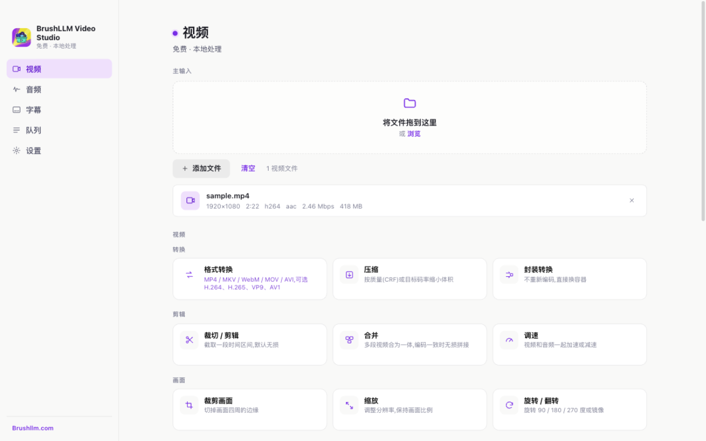
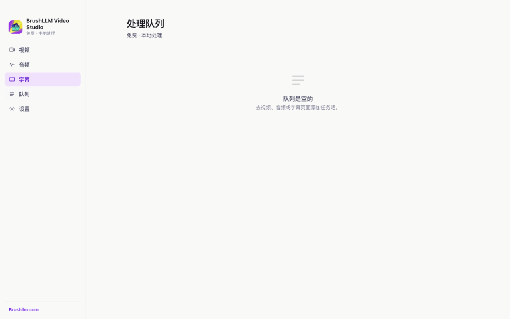

<p align="center">
  
</p>

<h1 align="center">BrushLLM Video Studio</h1>

<p align="center">
  <strong><a href="https://brushllm.com">🌐 brushllm.com</a></strong> · <a href="https://github.com/BrushLLM/brushllm-video-studio/releases">Releases</a>
</p>

<p align="center">A local-first desktop video toolbox — every tool runs 100% on your device for free, offline and private.</p>

<p align="center">
  
</p>

<p align="center">
  
</p>

[English](#english) | [Deutsch](#deutsch) | [Español](#español) | [Français](#français) | [Português (BR)](#português-br) | [简体中文](#简体中文) | [繁體中文](#繁體中文) | [日本語](#日本語) | [한국어](#한국어)

---

## English

### ✨ Features

**All tools — free, offline, private (zero network requests):**

| Tool | What it does |
| --- | --- |
| Convert Format | MP4 / MKV / WebM / MOV / AVI × H.264 / H.265 / VP9 / AV1 |
| Compress | Quality (CRF) or target bitrate — batch-capable |
| Merge | Join clips into one — lossless when codecs match |
| Trim / Cut | Time-range cutting, lossless by default |
| Crop Frame | Cut off edges — aspect-ratio presets |
| Scale | Resize with presets or custom — aspect preserved |
| Rotate / Flip | 90 / 180 / 270° rotation, horizontal / vertical mirror |
| Change Speed | 0.25–4× — video and audio together |
| Mute | Remove the audio track without re-encoding |
| Replace Audio | Swap in a new audio track |
| Extract Audio | Save as MP3, M4A, FLAC, WAV, OGG, Opus |
| Extract Frames | PNG / JPG stills or image sequences |
| GIF / WebP | Animated GIF (two-pass palette) or WebP |
| Embed Subtitles | Mux as switchable soft subtitle tracks |
| Burn Subtitles | Render permanently into the picture |
| Change Container | Repackage without re-encoding |
| Metadata | Inspect streams, codecs and tags |
| Audio Convert | MP3, M4A, FLAC, WAV, OGG, Opus |
| Audio Trim | Lossless time-range cutting |
| Volume | Adjust gain in decibels |
| Loudness | Normalize to EBU R128 broadcast standard |
| Subtitle Convert | SRT / VTT / ASS / SSA / TTML — instant |
| Subtitle Shift | Move all cues earlier or later |
| Subtitle Encoding | Fix legacy GBK / Big5 → UTF-8 |
| Subtitle Extract | Pull subtitle tracks out of a video |

**Highlights:** 9-language UI · hardware acceleration with honest GPU detection · batch processing · live CPU utilization display · prevent-sleep during processing · zero telemetry.

### 📥 Download

Grab the latest installer from [Releases](https://github.com/BrushLLM/brushllm-video-studio/releases):

| Platform | File |
| --- | --- |
| macOS (Apple Silicon) | `.dmg` |
| Windows 11 x64 | `.exe` |
| Windows 11 ARM64 | `.exe` |

Apps are unsigned — macOS Gatekeeper / Windows SmartScreen show a first-run warning.

### 🌐 Website

- Website: <https://brushllm.com>

### 🛠 Develop

```bash
npm install
npm run fetch-binaries   # download pinned FFmpeg/ffprobe (SHA-256 verified)
npm start                # launch the app
```

Tests: `npm test` (175 items — unit + end-to-end with real FFmpeg).

### Architecture

- **UI** — React 18 + Vite in Electron. `src/pages` (tool pages) → `src/components` → `src/lib/bridge.js` (typed IPC wrappers).
- **Engine** (`electron/engine`) — pure Node.js: `commands.js` (pure function: op + params → FFmpeg args, unit-tested), `queue.js` (job lifecycle, progress, pause/resume, CPU sampling), `resolve.mjs` (central encoding resolver shared by UI plan and actual command).
- **Subtitle engine** (`shared/subtitles.js`) — pure JS, no dependencies: parse/write SRT, VTT, ASS, SSA, TTML; charset detection (UTF-8/GBK/Big5/Shift-JIS).
- **Media engine** — pinned FFmpeg/ffprobe binaries per platform (SHA-256 verified), fetched via `scripts/fetch-binaries.mjs`.
- **CI** — GitHub Actions builds all three platform installers on tag push.

### Known limitations

- Image-based subtitles (PGS/DVD) are not supported yet — planned for the AI version.
- GPU acceleration uses VideoToolbox on macOS; NVENC/QSV/AMF code is ready but untested on Windows.
- Apps are unsigned (code signing can be added to CI later).

---

## Deutsch

Ein lokal-first Desktop-Werkzeugkasten für Video — alle Werkzeuge laufen kostenlos auf deinem Gerät, offline und privat.

**Werkzeuge:** Format konvertieren · Komprimieren · Zusammenfügen · Schneiden · Rogneren · Skalieren · Drehen · Geschwindigkeit · Stummschalten · Audio ersetzen · Audio extrahieren · Einzelbilder · GIF/WebP · Untertitel einbetten · Untertitel einbrennen · Container wechseln · Metadaten · Audio konvertieren · Lautstärke · Lautheit · Untertitel konvertieren · Untertitel verschieben · Untertitel-Kodierung.

**Highlights:** UI in 9 Sprachen · Hardware-Beschleunigung mit ehrlicher GPU-Erkennung · Stapelverarbeitung · CPU-Auslastung live · Ruhezustand verhindern · keine Telemetrie.

**📥 Herunterladen:** aktuelle Installationspakete auf [Releases](https://github.com/BrushLLM/brushllm-video-studio/releases) — macOS `.dmg`, Windows `.exe`. Unsignierte Apps lösen beim ersten Start eine Warnung aus.

**🌐 Website:** <https://brushllm.com>

Entwicklung und Architektur findest du im Abschnitt [English](#english).

---

## Español

Una caja de herramientas de vídeo local-first — todas las herramientas se ejecutan gratis en tu equipo, sin conexión y en privado.

**Herramientas:** Convertir formato · Comprimir · Unir · Recortar · Recortar encuadre · Redimensionar · Rotar · Velocidad · Silenciar · Reemplazar audio · Extraer audio · Fotogramas · GIF/WebP · Incrustar subtítulos · Grabar subtítulos · Cambiar contenedor · Metadatos · Convertir audio · Volumen · Sonoridad · Convertir subtítulos · Desplazar subtítulos · Codificación de subtítulos.

**Lo destacado:** interfaz en 9 idiomas · aceleración por hardware con detección honesta de GPU · proceso por lotes · uso de CPU en vivo · evitar suspensión · sin telemetría.

**📥 Descargar:** instaladores en [Releases](https://github.com/BrushLLM/brushllm-video-studio/releases) — macOS `.dmg`, Windows `.exe`. Apps sin firmar: aviso al primer inicio.

**🌐 Sitio web:** <https://brushllm.com>

Desarrollo y arquitectura, en la sección [English](#english).

---

## Français

Une boîte à outils vidéo local-first — tous les outils tournent gratuitement sur votre machine, hors ligne et en privé.

**Outils :** Convertir le format · Compresser · Fusionner · Découper · Rogner · Redimensionner · Pivoter · Vitesse · Muer · Remplacer l'audio · Extraire l'audio · Images · GIF/WebP · Incorporer des sous-titres · Graver des sous-titres · Changer de conteneur · Métadonnées · Convertir l'audio · Volume · Sonie · Convertir les sous-titres · Décaler les sous-titres · Encodage des sous-titres.

**Points forts :** interface en 9 langues · accélération matérielle avec détection honnête du GPU · traitement par lots · utilisation CPU en direct · éveiller pendant le traitement · zéro télémétrie.

**📥 Télécharger :** installateurs sur [Releases](https://github.com/BrushLLM/brushllm-video-studio/releases) — macOS `.dmg`, Windows `.exe`. Apps non signées : avertissement au premier lancement.

**🌐 Site web :** <https://brushllm.com>

Développement et architecture dans la section [English](#english).

---

## Português (BR)

Uma caixa de ferramentas de vídeo local-first — todas as ferramentas rodam grátis na sua máquina, offline e com privacidade.

**Ferramentas:** Converter formato · Comprimir · Unir · Recortar · Cortar quadro · Redimensionar · Girar · Velocidade · Silenciar · Substituir áudio · Extrair áudio · Quadros · GIF/WebP · Incorporar legendas · Gravar legendas · Trocar contêiner · Metadados · Converter áudio · Volume · Intensidade · Converter legendas · Deslocar legendas · Codificação de legendas.

**Destaques:** interface em 9 idiomas · aceleração por hardware com detecção honesta de GPU · processamento em lote · uso de CPU ao vivo · evitar suspensão · zero telemetria.

**📥 Baixar:** instaladores em [Releases](https://github.com/BrushLLM/brushllm-video-studio/releases) — macOS `.dmg`, Windows `.exe`. Apps não assinados: aviso no primeiro início.

**🌐 Site:** <https://brushllm.com>

Desenvolvimento e arquitetura na seção [English](#english).

---

## 简体中文

本地优先的桌面视频工具箱——所有工具 100% 在本机免费运行，离线且私密。

**工具：** 格式转换 · 压缩 · 合并 · 裁切 · 裁剪画面 · 缩放 · 旋转 · 调速 · 静音 · 替换音轨 · 提取音频 · 提取帧 · GIF/WebP 动图 · 字幕内嵌 · 字幕烧录 · 封装转换 · 元数据 · 音频转换 · 音量 · 响度标准化 · 字幕格式转换 · 时间轴平移 · 编码转换。

**亮点：** 九语言界面 · 硬件加速（诚实 GPU 检测）· 批量处理 · CPU 占用实时显示 · 处理时防睡眠 · 零遥测。

**📥 下载：** 最新安装包见 [Releases](https://github.com/BrushLLM/brushllm-video-studio/releases)——macOS `.dmg`、Windows `.exe`。应用未签名，首次运行会有系统提示。

**🌐 网站：** <https://brushllm.com>

开发与架构说明见 [English](#english) 章节。

---

## 繁體中文

本機優先的桌面影片工具箱——所有工具 100% 在本機免費執行，離線且私密。

**工具：** 格式轉換 · 壓縮 · 合併 · 裁切 · 裁剪畫面 · 縮放 · 旋轉 · 變速 · 靜音 · 替換音軌 · 擷取音訊 · 擷取影格 · GIF/WebP 動圖 · 字幕內嵌 · 字幕燒錄 · 封裝轉換 · 詮釋資料 · 音訊轉換 · 音量 · 響度標準化 · 字幕格式轉換 · 時間軸平移 · 編碼轉換。

**亮點：** 九語言介面 · 硬體加速（誠實 GPU 偵測）· 批次處理 · CPU 佔用即時顯示 · 處理時防睡眠 · 零遙測。

**📥 下載：** 最新安裝包見 [Releases](https://github.com/BrushLLM/brushllm-video-studio/releases)——macOS `.dmg`、Windows `.exe`。應用程式未簽署，首次執行會有系統提示。

**🌐 網站：** <https://brushllm.com>

開發與架構說明見 [English](#english) 章節。

---

## 日本語

ローカルファーストのデスクトップ動画ツールボックス — すべてのツールが 100% 端末上で無料で動作し、オフラインでプライベートです。

**ツール：** フォーマット変換 · 圧縮 · 結合 · トリミング · クロップ · リサイズ · 回転 · 速度変更 · ミュート · 音声置換 · 音声抽出 · フレーム抽出 · GIF/WebP · 字幕埋め込み · 字幕焼き付け · コンテナ変更 · メタデータ · 音声変換 · 音量 · ラウドネス · 字幕変換 · タイミングシフト · エンコード修正。

**ハイライト：** 9 言語 UI · ハードウェアアクセラレーション（誠実な GPU 検出）· 一括処理 · CPU 使用率のライブ表示 · 処理中のスリープ防止 · テレメトリなし。

**📥 ダウンロード：** 最新のインストーラーは [Releases](https://github.com/BrushLLM/brushllm-video-studio/releases) — macOS `.dmg`、Windows `.exe`。未署名のため初回起動時に警告が出ます。

**🌐 ウェブサイト：** <https://brushllm.com>

開発とアーキテクチャは [English](#english) セクションをご覧ください。

---

## 한국어

로컬 우선 데스크톱 비디오 도구함 — 모든 도구가 100% 기기에서 무료로 실행되며, 오프라인과 프라이버시를 보장합니다.

**도구:** 포맷 변환 · 압축 · 병합 · 자르기 · 크롭 · 크기 조정 · 회전 · 속도 · 음소거 · 오디오 교체 · 오디오 추출 · 프레임 추출 · GIF/WebP · 자막 삽입 · 자막 굽기 · 컨테이너 변경 · 메타데이터 · 오디오 변환 · 볼륨 · 라우드니스 · 자막 변환 · 타이밍 조정 · 인코딩 수정.

**하이라이트:** 9개 언어 UI · 하드웨어 가속 (정직한 GPU 감지) · 일괄 처리 · CPU 사용량 실시간 표시 · 처리 중 절전 방지 · 텔레메트리 없음.

**📥 다운로드:** 최신 설치 파일은 [Releases](https://github.com/BrushLLM/brushllm-video-studio/releases) — macOS `.dmg`, Windows `.exe`. 미서명 앱이라 첫 실행 시 경고가 표시됩니다.

**🌐 웹사이트:** <https://brushllm.com>

개발 및 아키텍처는 [English](#english) 섹션을 참고하세요.
